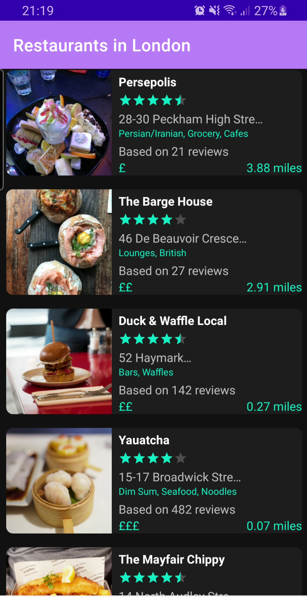
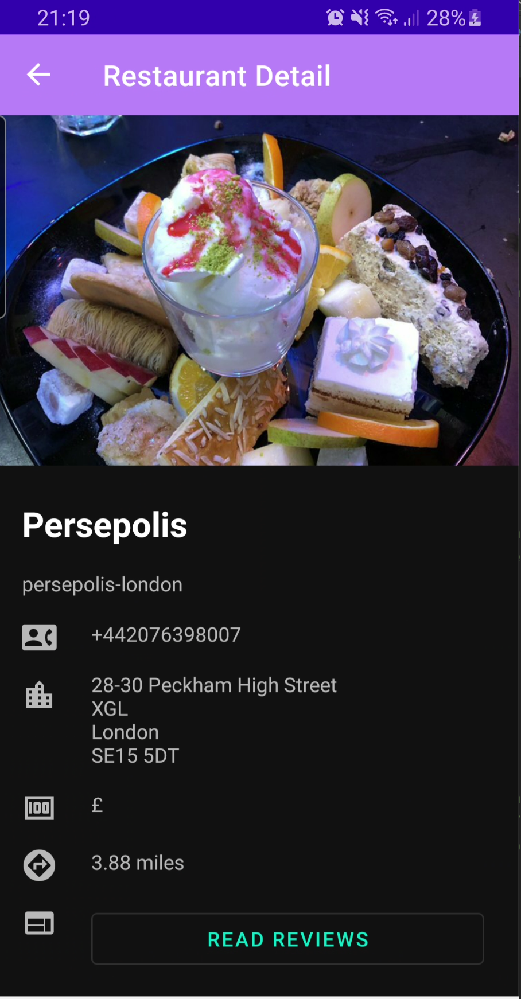
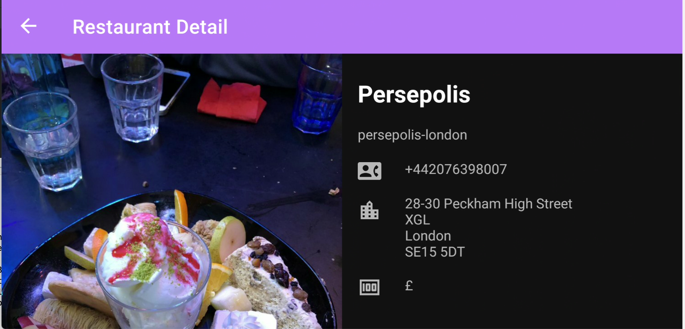
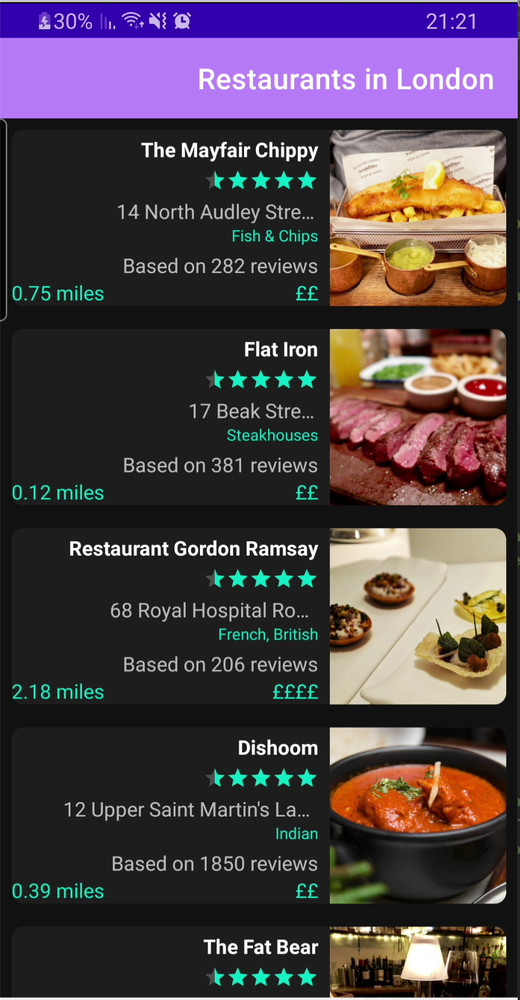
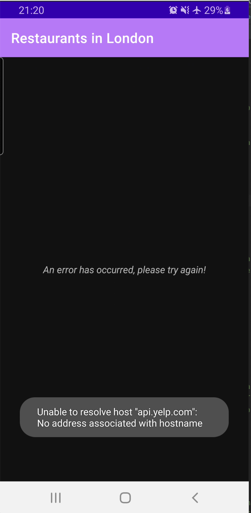

# YelpedApp

### Android Studio and Gradle version
The app is built using :
Android Studio **Arctic Fox | 2020.3.1** , together with **AGP 7**.

**AGP 7** uses **JDK 11** by default, so please make sure JDK 11 is available and set at
**Preferences -> Build, execution and deployment -> Gradle -> Gradle JDK**

### App details
The app uses the [Yelp business API](https://www.yelp.com/developers/documentation/v3/business_search) to get the restaurants data for a given location.
The app has main screen listing list of restaurants and detail screen. The detail screen provides a different view for landscape mode.

### App architecture

- The app is written with MVVM architecture in mind.
- App has DTO layer which then mapped to Domain layer objects. The ViewModel works with the Domain objects, which then propagated to UI layer using LiveData.
- All UI states are persisted across configuration changes using Android ViewModel.
- `SavedStateHandle` is used in the detail screen, so the screen will survive the process death.
- The data is cached with Room so the app works when there is no internet connection and data is persisted before.
- Hilt is used for dependency injection.
- View Models and repository are unit tested.

### UI Screen grabs

|main | detail | detail landscape
|------|------|------|
||||

|RTL | error |
|------|------|
|||
